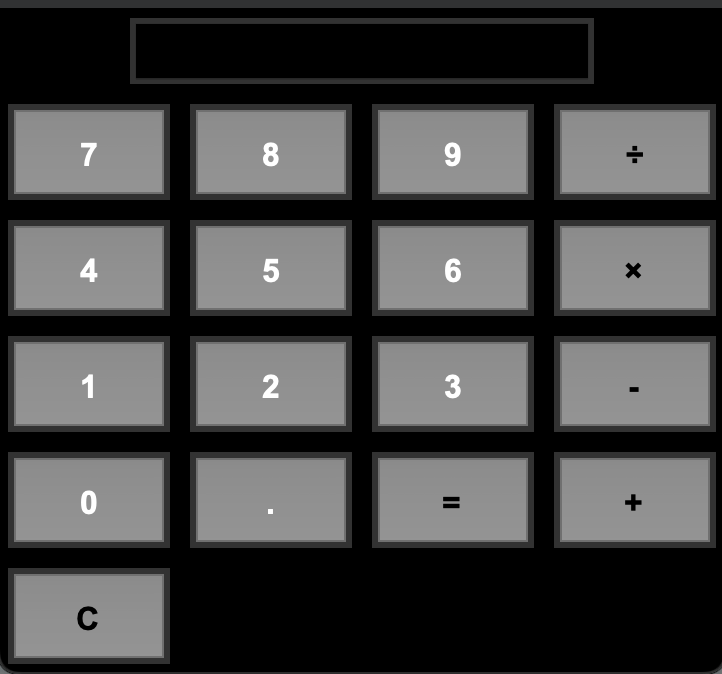

# mini calculator app
this project i made is simple calculator built with python and tkinter.

this project demonstrates GUI programming and clean code structure

## Tech Stack
- Language: Python
- Library: Tkinter (GUI)

## Features
- User-friendly graphical interface
- includes addition, subtraction, multiplication, and division
- Clear (`C`) button to reset calculations
- Structured into separate files:
  - `calculator.py` → math logic
  - `ui.py` → user interface (Tkinter)
  - `main.py` → entry point`

## screenshot


## calculator-app
│
├── calculator.py       # math logic
├── ui.py               # Tkinter interface
├── main.py             # entry point
├── image.png           # screenshot
├── README.md           # documentation
└── requirements.txt    # requirements for program

## How to Run

1. Clone this repository (download it to your computer):
   ```bash
   git clone https://github.com/NawidH05/calculator-app.git
   cd calculator-app
2. run the application with python:
python main.py
